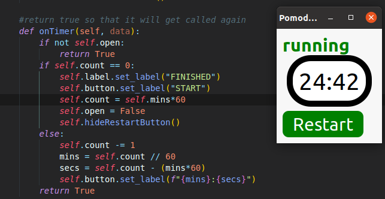

# Pomodoro Timer

**__A simple pomodoro widget for programmers__**

## Usage

`python pomodoro.py {mins}`

__mins__ is number of minutes to count down, default is **25**.

## Screenshots

## Click Start button to start

## Click Big middle button(countdown) to pause

## Want to restart countdown? *Click Restart*

## Installation
*Python 3.5+*

PyGObject, see installations [here] (https://pygobject.readthedocs.io/en/latest/getting_started.html).
